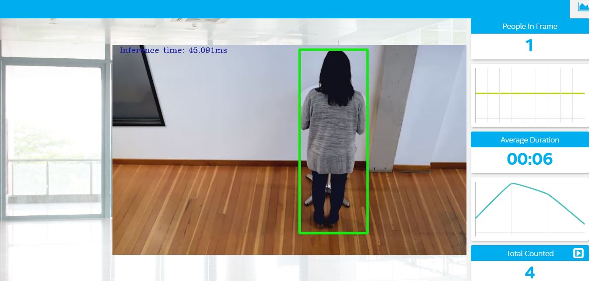

# Project Write-Up

People Counter App at the Edge is an application is used to count the number of peoples in a frame using the Intel® Distribution of the OpenVINO™ Toolkit (OpenVINO). 
The application performs inference on an input video, extracts and analyzes the output data, then sends that data to a server.

This application helps detect people in a certain area, provide the number of people in a frame, average duration spent by people in the frame and total count. 
This project has been developed as part of **Intel Edge AI for IoT Developers Nanodegree programme by Udacity**.

## Explaining Custom Layers

Custom layers are a necessary and important feature to have in the OpneVINO ToolKit, however it is not often used due to the fast coverage of the supported layers but it is useful to know about its existence and how to use it if the need arises. The list of supported layers is shown [here](https://docs.openvinotoolkit.org/2019_R3/_docs_MO_DG_prepare_model_Supported_Frameworks_Layers.html).

The process behind converting custom layers involves adding extensions to both:

1. **The Model Optimizer**: needs two necessary custom layer extensions
 - Custom Layer Extractor
 - Custom Layer Operation
2. **The Inference Engine**: needs two custom layer extensions
 - Custom Layer CPU extension
- Custom Layer GPU Extension

Potential reason for handling custom layers is the IR does not support all of the layers from original framework. Sometimes because of the hardware, for example on CPU there are few IR models which are directly supported while others may not be supported.

## Comparing Model Performance

Comparision of My models (using threshold of 0.6):

| Model                 | Size (MB) | Accuracy (%) | Inference Time (HH:MM:SS) |
|-----------------------|-----------|-------------|---------------------------|
| SSD Inception V2 COCO | 265.23    | 63.41       | 00:05:10 |
| SSD MobileNet V2 COCO | 179.22    | 76.61       | 00:03:11 |
| person-detection-retail-0013 | 2.75 | 97.63     | 00:02:43 |

I used the [person-detection-retail-0013](https://docs.openvinotoolkit.org/latest/_models_intel_person_detection_retail_0013_description_person_detection_retail_0013.html) model in this application as it is providing a good accuracy and count.

## Assess Model Use Cases

This People Counter App has an important application in many business sectors where customer service is of great importance. This application can help business owners to monitor their customers and use the generated statistics to make informed decision on how to better serve their customers.

Some of the potential use cases of the people counter app include but not limited to:

1. Retail stores: where this can be deployed to monitor customers shopping habits and can be used to optimise their staffing needs during the peak hours and to place more staff on shopping grounds. It can also be used to optimise merchandising.
2. Security Industry: It can be used to monitor trespassers from entering secured areas or premises.
3. Hospital: To maintain the number of patients that can be allowed to enter a particular area, so that if the number is increasing, they can be notified to call for observation.
4. Railway Stations or Airports: For example this app can be used to monitor the number of people if they are observing social distancing particularly during COVID-19 kind of situations.
5. In self-driving vehicles for example, it can be used to detect the presence of person on the road and even in many smart cars nowadays 360 cameras have been used to detect objects including people are helpful when reversing the car.


## Assess Effects on End User Needs

Lighting, model accuracy, and camera focal length/image size have different effects on a deployed edge model. The potential effects of each of these are as follows:

- Lighting: if there isn't a sufficient amount of light the model can't predict in the dark properly.
- Model accuracy: Since the decisions need to be made so fast the model need to be accurate, there is no place to make mistakes.
- Camera focal: The longer the focal length, the narrower the angle of view and the higher the magnification. The shorter the focal length, the wider the angle of view and the lower the magnification. So camera focal needs to be chosen based on the user needs.
- Length/Image size: if the image size is small the model can't predict accurately and if the size is large the model will take a long time to finish.

## Model Research

I tried using the models **SSD Inception V2 COCO**, **SSD MobileNet V2 COCO** and **person-detection-retail-0013**.

### Download and unzip TensorFlow models

Download the model
```
wget model_link
```

example: `wget http://download.tensorflow.org/models/object_detection/ssd_inception_v2_coco_2018_01_28.tar.gz`

Unzip the model
```
tar -xvf model_name.tar.gz
```
example: `tar -xvf ssd_inception_v2_coco_2018_01_28.tar.gz`

### Convert the models to Intermediate Representation (IR)

Traverse to the model folder
```
cd model_folder
```
example: `cd ssd_inception_v2_coco_2018_01_28`


In investigating potential people counter models, I tried each of the following three models:

- Model 1: [SSD Inception V2 COCO](http://download.tensorflow.org/models/object_detection/ssd_inception_v2_coco_2018_01_28.tar.gz)
  - I converted the model to an Intermediate Representation with the following code 
  ```
  python /opt/intel/openvino/deployment_tools/model_optimizer/mo.py --input_model frozen_inference_graph.pb --tensorflow_object_detection_api_pipeline_config pipeline.config --reverse_input_channels --tensorflow_use_custom_operations_config /opt/intel/openvino/deployment_tools/model_optimizer/extensions/front/tf/ssd_v2_support.json
  ```
  - The model was insufficient for the app because it needs a large memory storage, takes much time to inference and also the accuracy is not sufficient.
  - I tried the model using the threshold 0.5, the accuracy was 68.58%. Still need better model.
  
- Model 2: [SSD MobileNet V2 COCO](http://download.tensorflow.org/models/object_detection/ssd_mobilenet_v2_coco_2018_03_29.tar.gz)
  - I converted the model to an Intermediate Representation with the following code
  ```
  python /opt/intel/openvino/deployment_tools/model_optimizer/mo.py --input_model frozen_inference_graph.pb --tensorflow_object_detection_api_pipeline_config pipeline.config --reverse_input_channels --tensorflow_use_custom_operations_config /opt/intel/openvino/deployment_tools/model_optimizer/extensions/front/tf/ssd_v2_support.json
  ```
  - The model is insufficient for the app because it uses much memory and the accuracy is not satisfactory.

- Model 3: [person-detection-retail-0013](https://docs.openvinotoolkit.org/latest/_models_intel_person_detection_retail_0013_description_person_detection_retail_0013.html)
  - Pre-trained model on OpenVINO
  - Download person-detection-retail-0013 model  
  `sudo /opt/intel/openvino/deployment_tools/open_model_zoo/tools/downloader/downloader.py --name person-detection-retail-0013 --precisions FP32`
  - The model is very light, takes less time for inference and the accuracy is also good.

## Running the People Counter App
To run the People Counter App, the following command arguments were used:
```
python main.py -i resources/Pedestrian_Detect_2_1_1.mp4 -m intel/person-detection-retail-0013/FP32/person-detection-retail-0013.xml -l /opt/intel/openvino/deployment_tools/inference_engine/lib/intel64/libcpu_extension_sse4.so -d CPU -pt 0.6 | ffmpeg -v warning -f rawvideo -pixel_format bgr24 -video_size 768x432 -framerate 24 -i - http://0.0.0.0:3004/fac.ffm
```

**Note**: Before running the code follow the instructions on [README.MD](./README.MD) file to Start the Mosca server, the GUI and FFmpeg Server.

Following are some of the images while using the app:



