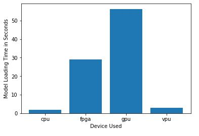
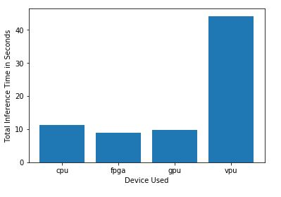
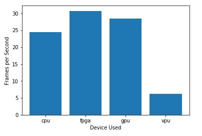
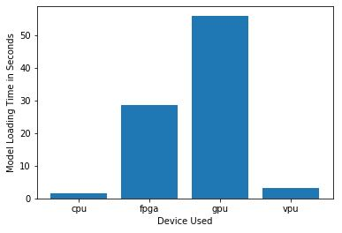
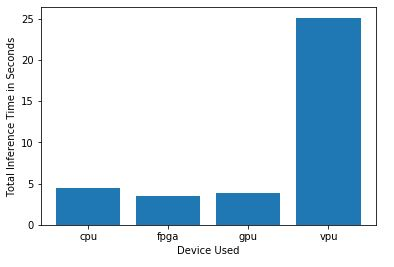
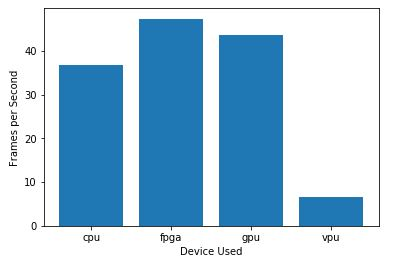
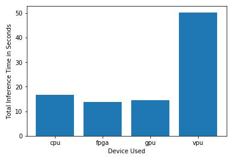
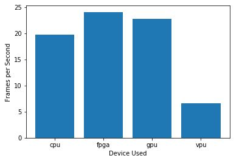

# Smart Queuing  System
This Smart Queuing System is a project completed in the Udacity's *Intel® Edge AI for IoT Developers Nanodegree* as a part of **Intel® Edge AI Scholarship Program - 2020**.

## Project Overview
In this project we worked on three different scenarios that depict real-world problems based on different sectors where edge devices are typically deployed.

The three scenarios we will be looking at are:
- Scenario 1: Manufacturing Sector
- Scenario 2: Retail Sector
- Scenario 3: Transportation Sector

## Hardware Proposal
All of the scenarios involve people in queues, but each scenario will require different hardware. So our first task is to determine which hardware might work for each scenario - and then explain our initial choice. Please check the document [Choose the right hardware proposal Template](./choose-the-right-hardware-proposal-template.pdf)

Later, we built and tested our application on each hardware device for all the scenarios, reviewed the results and validated our initial proposed choices in the proposed document.

## Requirements

#### Hardware:
  1. CPU - [Intel® Core™ i5-6500TE processor](https://ark.intel.com/products/88186/Intel-Core-i5-6500TE-Processor-6M-Cache-up-to-3-30-GHz-)
  2. GPU - Intel® HD Graphics 530
  3. VPU - [Intel Neural Compute Stick 2](https://software.intel.com/en-us/neural-compute-stick)
  4. FPGA - [IEI Mustang-F100-A10](https://www.ieiworld.com/mustang-f100/en/)
  
#### Software:
* [Intel® Distribution of OpenVINO™ toolkit](https://docs.openvinotoolkit.org/2020.3/index.html)

#### Model
* [person-detection-retail-0013](https://docs.openvinotoolkit.org/2018_R5/_docs_Retail_object_detection_pedestrian_rmnet_ssd_0013_caffe_desc_person_detection_retail_0013.html)

## Project Steps

1. Create a Python Script for the Person Detect Model. It will create person_detect.py file which can be used to run the person detection model.
2. Create a Job Submission Script. It will create queue_job.sh file which will run our scenario jobs in queue to find out the performance of our model.
3. Working through each scenarios notebook, through each notebook we will submit our jobs to Intel's DevCloud to load and run inference on each type of hardware and then review the results.

## Results
Tested the model on the videos in [original_videos](./original_videos) folder with FP16 Model Precision for each device (CPU, GPU, VPU and FPGA)
The resulted videos and statistics can be found at the [results](./results) folder.

The following graphs shows the Model Load Time, Inference Time and Frames per Second (FPS) for various devices (CPU, GPU, VPU and FPGA) used in the respective scenarios.

#### Manufacturing Scenario result graphs

- Model Load Time  

- Inference Time  

- Frames Per Second (FPS)  

#### Retail Scenario result graphs

- Model Load Time  

- Inference Time  

- Frames Per Second (FPS)  

#### Transportation Scenario result graphs

- Model Load Time  

- Inference Time  

- Frames Per Second (FPS)  
