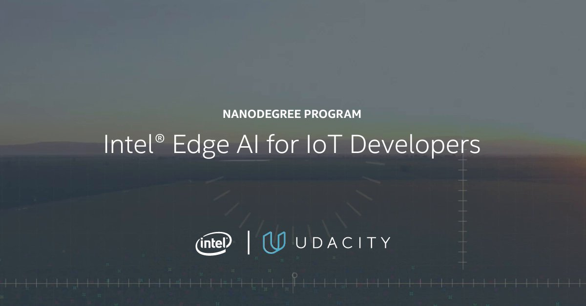
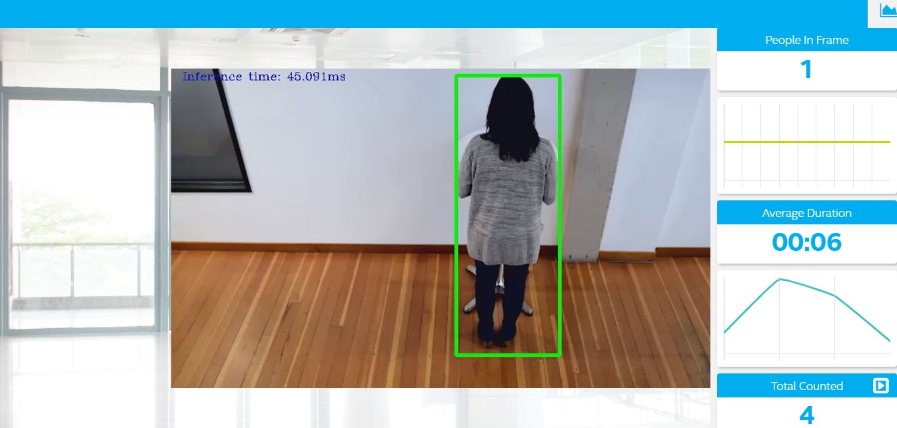

# Intel® Edge AI for IoT Developers Nanodegree 

This repository contains the projects completed in the Udacity's *Intel® Edge AI for IoT Developers Nanodegree* as a part of **Intel® Edge AI Scholarship Program - 2020**.

The course introduces to the basics of AI at the Edge, leverage pre-trained models available with the Intel® Distribution of OpenVINO Toolkit™, 
convert and optimize other models with the Model Optimizer, and perform inference with the Inference Engine. 
Also we will learn topics for edge applications, like MQTT and how to stream video to servers.
Gives insights into choosing the right hardware (CPU, VPU, FPGA, and Integrated GPU) for the project. 
We can also distribute workload on available compute devices in order to improve model performance.
We also, learn how to optimize our model and application code to reduce inference time when running model at the edge.

## Projects

### Deploy a People Counter App at the Edge
>[P1_Deploy-a-People-Counter-App-at-the-Edge](https://github.com/govind-savara/Intel-Edge-AI-for-IoT-Developers/tree/master/P1_Deploy-a-People-Counter-App-at-the-Edge)

The people counter application will demonstrate how to create a smart video IoT solution using Intel® hardware and software tools. The app will detect people in a designated area, providing the number of people in the frame, average duration of people in frame, and total count.

### Smart Queuing System
>[P2_Smart-Queuing-System](https://github.com/govind-savara/Intel-Edge-AI-for-IoT-Developers/tree/master/P2_Smart-Queuing-System)

In this project we worked on three different scenarios that depict real-world problems based on different sectors where edge devices are typically deployed.

The three scenarios we will be looking at are:
- Scenario 1: Manufacturing Sector
- Scenario 2: Retail Sector
- Scenario 3: Transportation Sector

All of the scenarios involve people in queues, but each scenario will require different hardware. In this project we used different devices (CPU, GPU, VPU, and FPGA) to run the model and using the results we proposed a suitable device for the respective scenario.

